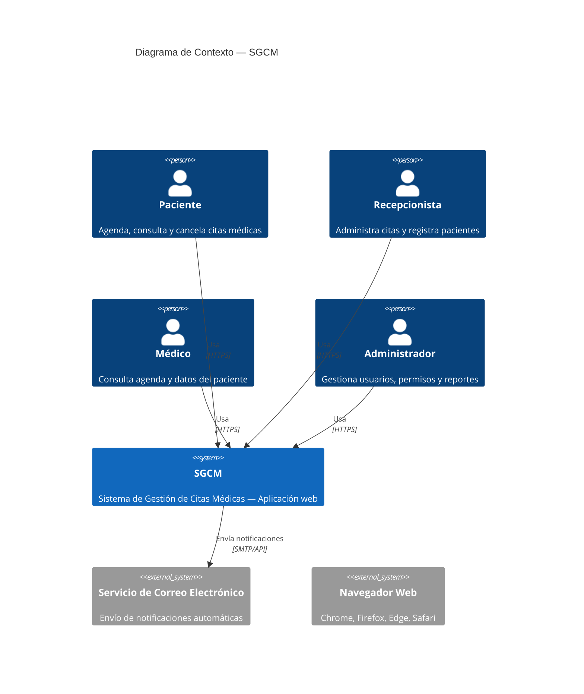
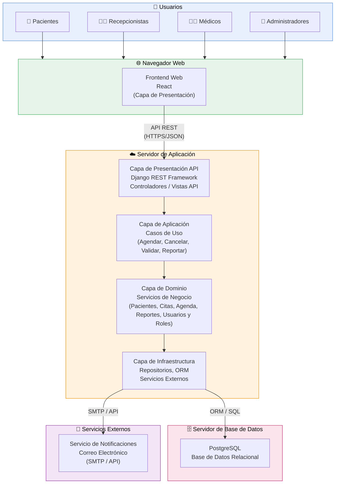
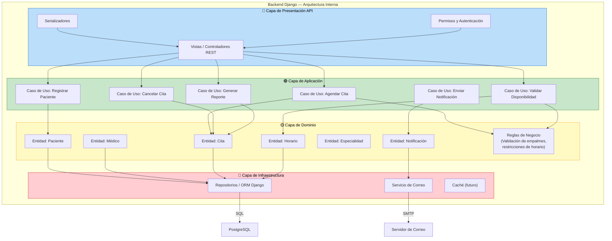
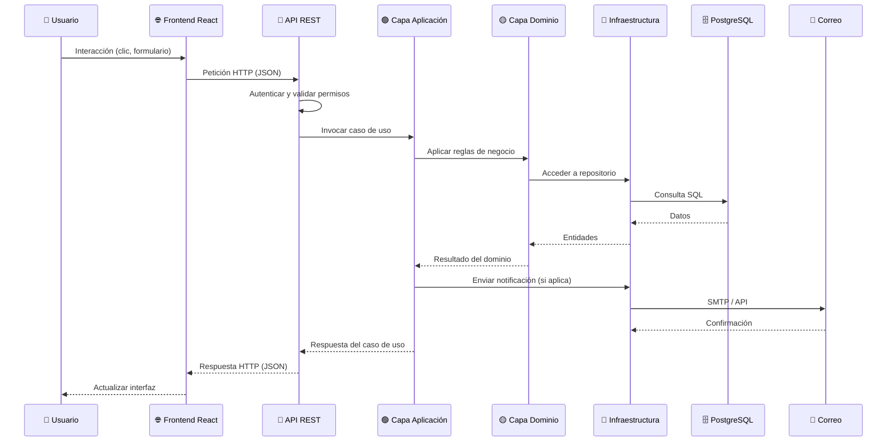

# 🏗️ Documento de Diseño de Arquitectura de Software

**Proyecto:** Sistema de Gestión de Citas Médicas (SGCM — Médico 2.0)  
**Versión:** 1.0 | **Fecha:** 2026  
**Elaborado por:** Equipo de Desarrollo

---

## 1. Introducción

Este documento describe el diseño de la arquitectura de software del SGCM. La arquitectura propuesta es **desacoplada, escalable, mantenible y económicamente viable**, sirviendo como guía técnica para el desarrollo, despliegue y evolución del sistema.

## 2. Contexto General del Sistema

El SGCM es un sistema web independiente que digitaliza el proceso de asignación y control de citas médicas para la Clínica Patito, permitiendo gestionar pacientes, agendas médicas, notificaciones y reportes administrativos.

---

## 3. Diagrama de Contexto del Sistema

Muestra al SGCM como caja negra y sus interacciones con actores y sistemas externos.

---

## 4. Diagrama de Arquitectura General (Vista de Capas)

Arquitectura en capas desacopladas con API REST. Presenta los grandes bloques del sistema y sus relaciones.

---

## 5. Diagrama de Arquitectura Interna del Backend

Detalla las 4 capas internas del backend Django y sus responsabilidades.

---

## 6. Flujo de Comunicación entre Capas

---

## 7. Estilo Arquitectónico Seleccionado

**Arquitectura en capas desacopladas con API REST**

| Característica | Descripción |
|----------------|-------------|
| **Estilo** | Capas desacopladas + API REST |
| **Frontend** | Single Page Application (React) |
| **Backend** | Django con Django REST Framework |
| **Base de datos** | PostgreSQL |
| **Comunicación** | HTTP/HTTPS con formato JSON |
| **Notificaciones** | Servicio externo vía SMTP/API |
| **Despliegue** | AWS Lightsail |

### Justificación

- **Desacoplamiento:** Frontend y Backend evolucionan independientemente.
- **Escalabilidad:** Permite escalar el backend sin modificar el frontend.
- **Mantenibilidad:** Cambios localizados por capa, sin propagación de impacto.
- **Seguridad:** Autenticación centralizada en el backend.
- **Portabilidad:** Accesible desde cualquier navegador moderno.
- **Evolución:** Base sólida para módulos futuros (historial clínico, pagos en línea).

---

## 8. Tabla de Trazabilidad: Requisitos → Arquitectura

| Requisito | Descripción | Componente Arquitectónico | Módulo | Justificación |
|-----------|-------------|---------------------------|--------|---------------|
| RF-01 | Registrar y administrar pacientes | Backend Django — Servicios de dominio | Módulo Pacientes | Centraliza validaciones e integridad de datos |
| RF-02 | Agendar, modificar y cancelar citas | Backend Django — Servicios de dominio | Módulo Citas | Controla reglas de negocio y evita conflictos |
| RF-03 | Validar disponibilidad de horarios | Backend Django — Servicios de dominio | Módulo Agenda | Valida empalmes y reglas antes de confirmar |
| RF-04 | Enviar notificaciones automáticas | Servicio externo integrado al backend | Módulo Notificaciones | Desacopla envío de mensajes de la lógica principal |
| RF-05 | Generar reportes administrativos | Backend Django — Servicios de dominio | Módulo Reportes | Consultas agregadas y exportación |
| RNF-Rendimiento | ≤ 2 segundos | Arquitectura desacoplada Front–Back | API REST | Reduce carga y optimiza peticiones |
| RNF-Seguridad | Autenticación y control de acceso | Backend + capa de seguridad | Usuarios y Roles | Centraliza autenticación y permisos |
| RNF-Disponibilidad | ≥ 95% | Infraestructura en nube | AWS Lightsail | Reduce caídas, facilita recuperación |
| RNF-Mantenibilidad | Actualizaciones sencillas | Arquitectura por capas | Todos los módulos | Cambios localizados |
| RNF-Portabilidad | Multiplataforma | Frontend desacoplado | React | Compatible con navegadores modernos |

---

## 9. Conclusión

La arquitectura propuesta cumple con los requisitos funcionales y no funcionales del SGCM, aplicando principios de diseño de software que garantizan **escalabilidad, seguridad, mantenibilidad y portabilidad**. El uso de una arquitectura desacoplada con API REST y PostgreSQL proporciona una base técnica sólida para la evolución futura del sistema.
