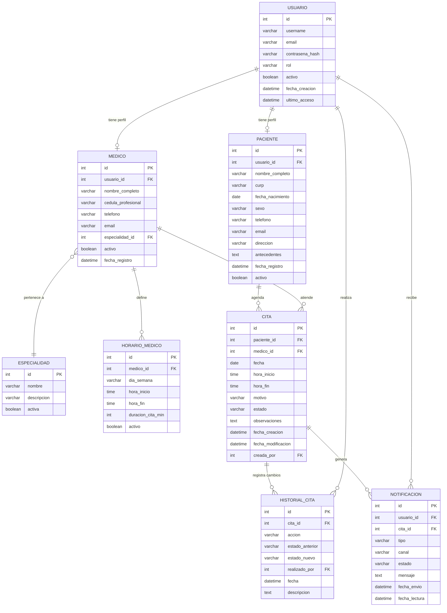
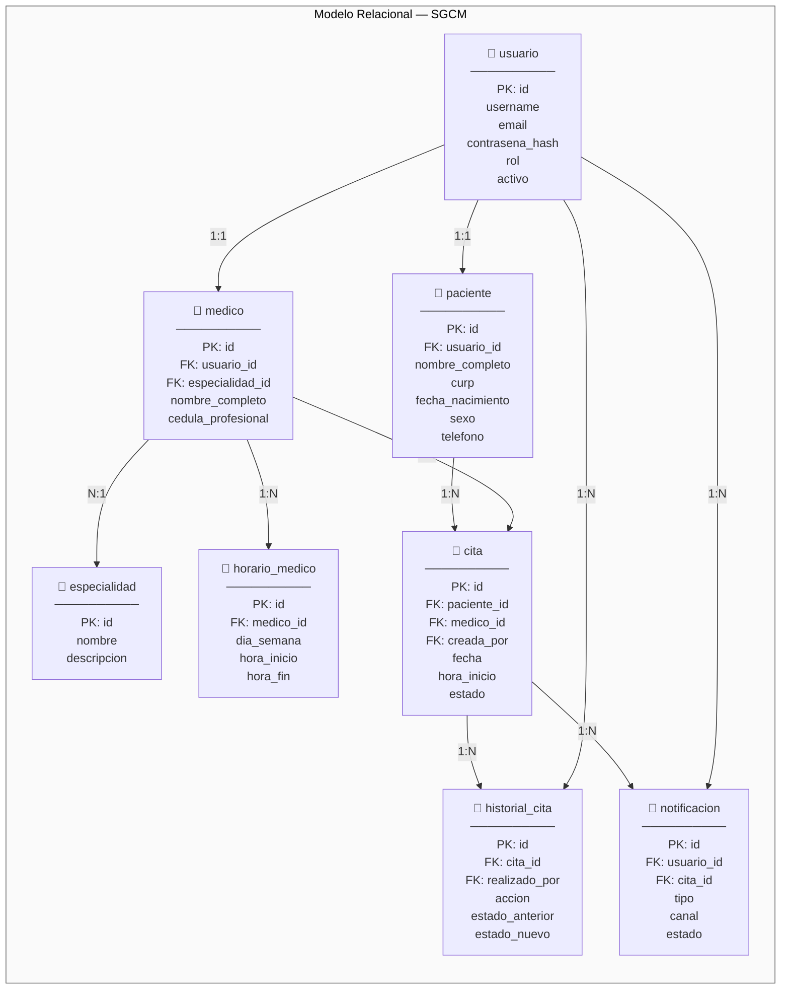

# 🗄️ Diseño de Datos — SGCM

**Proyecto:** Sistema de Gestión de Citas Médicas  
**Versión:** 1.0 | **Fecha:** 2026

---

## 1. Diagrama Entidad-Relación (ER)

El siguiente diagrama define la estructura lógica de la base de datos, identificando las entidades principales del sistema y sus relaciones.

---

## 2. Modelo Relacional

Representación de las tablas con sus llaves primarias (PK), foráneas (FK) y tipos de datos.

### Tabla: `usuario`

| Columna | Tipo | Restricciones | Descripción |
|---------|------|---------------|-------------|
| `id` | INT | PK, AUTO_INCREMENT | Identificador único |
| `username` | VARCHAR(50) | UNIQUE, NOT NULL | Nombre de usuario |
| `email` | VARCHAR(100) | UNIQUE, NOT NULL | Correo electrónico |
| `contrasena_hash` | VARCHAR(255) | NOT NULL | Contraseña cifrada |
| `rol` | VARCHAR(20) | NOT NULL | `paciente`, `recepcionista`, `medico`, `admin` |
| `activo` | BOOLEAN | DEFAULT TRUE | Estado del usuario |
| `fecha_creacion` | DATETIME | NOT NULL | Fecha de registro |
| `ultimo_acceso` | DATETIME | NULLABLE | Último inicio de sesión |

### Tabla: `paciente`

| Columna | Tipo | Restricciones | Descripción |
|---------|------|---------------|-------------|
| `id` | INT | PK, AUTO_INCREMENT | Identificador único |
| `usuario_id` | INT | FK → `usuario.id`, UNIQUE | Referencia al usuario |
| `nombre_completo` | VARCHAR(150) | NOT NULL | Nombre completo del paciente |
| `curp` | VARCHAR(18) | UNIQUE, NULLABLE | CURP del paciente |
| `fecha_nacimiento` | DATE | NOT NULL | Fecha de nacimiento |
| `sexo` | VARCHAR(10) | NOT NULL | `Masculino`, `Femenino`, `Otro` |
| `telefono` | VARCHAR(15) | NOT NULL | Teléfono de contacto |
| `email` | VARCHAR(100) | NULLABLE | Correo electrónico |
| `direccion` | VARCHAR(255) | NULLABLE | Dirección del paciente |
| `antecedentes` | TEXT | NULLABLE | Antecedentes médicos básicos |
| `fecha_registro` | DATETIME | NOT NULL | Fecha de alta en el sistema |
| `activo` | BOOLEAN | DEFAULT TRUE | Registro activo/inactivo |

### Tabla: `medico`

| Columna | Tipo | Restricciones | Descripción |
|---------|------|---------------|-------------|
| `id` | INT | PK, AUTO_INCREMENT | Identificador único |
| `usuario_id` | INT | FK → `usuario.id`, UNIQUE | Referencia al usuario |
| `nombre_completo` | VARCHAR(150) | NOT NULL | Nombre del médico |
| `cedula_profesional` | VARCHAR(20) | UNIQUE, NOT NULL | Cédula profesional |
| `telefono` | VARCHAR(15) | NULLABLE | Teléfono |
| `email` | VARCHAR(100) | NULLABLE | Correo electrónico |
| `especialidad_id` | INT | FK → `especialidad.id` | Especialidad médica |
| `activo` | BOOLEAN | DEFAULT TRUE | Registro activo/inactivo |
| `fecha_registro` | DATETIME | NOT NULL | Fecha de alta |

### Tabla: `especialidad`

| Columna | Tipo | Restricciones | Descripción |
|---------|------|---------------|-------------|
| `id` | INT | PK, AUTO_INCREMENT | Identificador único |
| `nombre` | VARCHAR(100) | UNIQUE, NOT NULL | Nombre de la especialidad |
| `descripcion` | VARCHAR(255) | NULLABLE | Descripción de la especialidad |
| `activa` | BOOLEAN | DEFAULT TRUE | Especialidad activa/inactiva |

### Tabla: `horario_medico`

| Columna | Tipo | Restricciones | Descripción |
|---------|------|---------------|-------------|
| `id` | INT | PK, AUTO_INCREMENT | Identificador único |
| `medico_id` | INT | FK → `medico.id`, NOT NULL | Médico al que pertenece |
| `dia_semana` | VARCHAR(10) | NOT NULL | `Lunes`, `Martes`, ..., `Sábado` |
| `hora_inicio` | TIME | NOT NULL | Hora de inicio de la jornada |
| `hora_fin` | TIME | NOT NULL | Hora de fin de la jornada |
| `duracion_cita_min` | INT | NOT NULL, DEFAULT 30 | Duración de cada cita en minutos |
| `activo` | BOOLEAN | DEFAULT TRUE | Horario activo/inactivo |

### Tabla: `cita`

| Columna | Tipo | Restricciones | Descripción |
|---------|------|---------------|-------------|
| `id` | INT | PK, AUTO_INCREMENT | Identificador único |
| `paciente_id` | INT | FK → `paciente.id`, NOT NULL | Paciente que agenda |
| `medico_id` | INT | FK → `medico.id`, NOT NULL | Médico asignado |
| `fecha` | DATE | NOT NULL | Fecha de la cita |
| `hora_inicio` | TIME | NOT NULL | Hora de inicio |
| `hora_fin` | TIME | NOT NULL | Hora de fin |
| `motivo` | VARCHAR(255) | NOT NULL | Motivo de la consulta |
| `estado` | VARCHAR(20) | NOT NULL, DEFAULT `programada` | `programada`, `confirmada`, `atendida`, `cancelada` |
| `observaciones` | TEXT | NULLABLE | Observaciones adicionales |
| `fecha_creacion` | DATETIME | NOT NULL | Fecha de creación del registro |
| `fecha_modificacion` | DATETIME | NULLABLE | Última modificación |
| `creada_por` | INT | FK → `usuario.id` | Usuario que creó la cita |

> **Restricción UNIQUE compuesta:** `(medico_id, fecha, hora_inicio)` — Impide que un médico tenga dos citas al mismo tiempo.

### Tabla: `historial_cita`

| Columna | Tipo | Restricciones | Descripción |
|---------|------|---------------|-------------|
| `id` | INT | PK, AUTO_INCREMENT | Identificador único |
| `cita_id` | INT | FK → `cita.id`, NOT NULL | Cita asociada |
| `accion` | VARCHAR(50) | NOT NULL | `creación`, `modificación`, `cancelación` |
| `estado_anterior` | VARCHAR(20) | NULLABLE | Estado previo |
| `estado_nuevo` | VARCHAR(20) | NOT NULL | Nuevo estado |
| `realizado_por` | INT | FK → `usuario.id` | Quién realizó la acción |
| `fecha` | DATETIME | NOT NULL | Fecha y hora del cambio |
| `descripcion` | TEXT | NULLABLE | Nota descriptiva del cambio |

### Tabla: `notificacion`

| Columna | Tipo | Restricciones | Descripción |
|---------|------|---------------|-------------|
| `id` | INT | PK, AUTO_INCREMENT | Identificador único |
| `usuario_id` | INT | FK → `usuario.id`, NOT NULL | Destinatario |
| `cita_id` | INT | FK → `cita.id`, NULLABLE | Cita relacionada |
| `tipo` | VARCHAR(30) | NOT NULL | `confirmación`, `recordatorio`, `cancelación`, `modificación` |
| `canal` | VARCHAR(20) | NOT NULL | `email`, `sms` |
| `estado` | VARCHAR(20) | NOT NULL, DEFAULT `pendiente` | `pendiente`, `enviada`, `fallida`, `leída` |
| `mensaje` | TEXT | NOT NULL | Contenido del mensaje |
| `fecha_envio` | DATETIME | NULLABLE | Fecha de envío |
| `fecha_lectura` | DATETIME | NULLABLE | Fecha de lectura |

---

## 3. Diagrama del Modelo Relacional

---

## 4. Diccionario de Datos

### Entidad: Usuario

| Atributo | Tipo | Obligatorio | Descripción |
|----------|------|:-----------:|-------------|
| id | INT | ✅ | Identificador único del usuario |
| username | VARCHAR(50) | ✅ | Nombre de usuario para acceso al sistema |
| email | VARCHAR(100) | ✅ | Correo electrónico del usuario |
| contrasena_hash | VARCHAR(255) | ✅ | Contraseña almacenada en formato hash (SHA-256) |
| rol | VARCHAR(20) | ✅ | Rol del usuario: paciente, recepcionista, medico, admin |
| activo | BOOLEAN | ✅ | Indica si el usuario está habilitado (TRUE/FALSE) |
| fecha_creacion | DATETIME | ✅ | Fecha y hora de creación de la cuenta |
| ultimo_acceso | DATETIME | ❌ | Fecha y hora del último inicio de sesión |

### Entidad: Paciente

| Atributo | Tipo | Obligatorio | Descripción |
|----------|------|:-----------:|-------------|
| id | INT | ✅ | Identificador único del paciente |
| usuario_id | INT | ✅ | FK al usuario asociado |
| nombre_completo | VARCHAR(150) | ✅ | Nombre completo del paciente |
| curp | VARCHAR(18) | ❌ | Clave Única de Registro de Población |
| fecha_nacimiento | DATE | ✅ | Fecha de nacimiento del paciente |
| sexo | VARCHAR(10) | ✅ | Sexo biológico: Masculino, Femenino, Otro |
| telefono | VARCHAR(15) | ✅ | Número telefónico principal |
| email | VARCHAR(100) | ❌ | Correo electrónico de contacto |
| direccion | VARCHAR(255) | ❌ | Domicilio del paciente |
| antecedentes | TEXT | ❌ | Antecedentes médicos básicos del paciente |
| fecha_registro | DATETIME | ✅ | Fecha y hora de alta en el sistema |
| activo | BOOLEAN | ✅ | Registro activo en el sistema |

### Entidad: Médico

| Atributo | Tipo | Obligatorio | Descripción |
|----------|------|:-----------:|-------------|
| id | INT | ✅ | Identificador único del médico |
| usuario_id | INT | ✅ | FK al usuario asociado |
| nombre_completo | VARCHAR(150) | ✅ | Nombre completo del profesional |
| cedula_profesional | VARCHAR(20) | ✅ | Cédula profesional emitida por la SEP |
| telefono | VARCHAR(15) | ❌ | Teléfono de contacto |
| email | VARCHAR(100) | ❌ | Correo electrónico |
| especialidad_id | INT | ✅ | FK a la especialidad médica |
| activo | BOOLEAN | ✅ | Indica si el médico está activo |
| fecha_registro | DATETIME | ✅ | Fecha de alta en el sistema |

### Entidad: Especialidad

| Atributo | Tipo | Obligatorio | Descripción |
|----------|------|:-----------:|-------------|
| id | INT | ✅ | Identificador único |
| nombre | VARCHAR(100) | ✅ | Nombre de la especialidad (ej. Cardiología, Pediatría) |
| descripcion | VARCHAR(255) | ❌ | Descripción breve de la especialidad |
| activa | BOOLEAN | ✅ | Especialidad vigente en el catálogo |

### Entidad: Horario Médico

| Atributo | Tipo | Obligatorio | Descripción |
|----------|------|:-----------:|-------------|
| id | INT | ✅ | Identificador único |
| medico_id | INT | ✅ | FK al médico propietario del horario |
| dia_semana | VARCHAR(10) | ✅ | Día de la semana (Lunes a Sábado) |
| hora_inicio | TIME | ✅ | Hora de inicio de atención |
| hora_fin | TIME | ✅ | Hora de fin de atención |
| duracion_cita_min | INT | ✅ | Duración estándar de cada cita en minutos |
| activo | BOOLEAN | ✅ | Horario vigente |

### Entidad: Cita

| Atributo | Tipo | Obligatorio | Descripción |
|----------|------|:-----------:|-------------|
| id | INT | ✅ | Identificador único de la cita |
| paciente_id | INT | ✅ | FK al paciente que agenda |
| medico_id | INT | ✅ | FK al médico que atiende |
| fecha | DATE | ✅ | Fecha programada de la cita |
| hora_inicio | TIME | ✅ | Hora de inicio de la cita |
| hora_fin | TIME | ✅ | Hora de finalización de la cita |
| motivo | VARCHAR(255) | ✅ | Razón de la consulta |
| estado | VARCHAR(20) | ✅ | Estado: programada, confirmada, atendida, cancelada |
| observaciones | TEXT | ❌ | Notas adicionales sobre la cita |
| fecha_creacion | DATETIME | ✅ | Fecha de registro en el sistema |
| fecha_modificacion | DATETIME | ❌ | Última actualización del registro |
| creada_por | INT | ✅ | FK al usuario que registró la cita |

### Entidad: Historial de Cita

| Atributo | Tipo | Obligatorio | Descripción |
|----------|------|:-----------:|-------------|
| id | INT | ✅ | Identificador único |
| cita_id | INT | ✅ | FK a la cita afectada |
| accion | VARCHAR(50) | ✅ | Tipo de acción: creación, modificación, cancelación |
| estado_anterior | VARCHAR(20) | ❌ | Estado previo de la cita |
| estado_nuevo | VARCHAR(20) | ✅ | Nuevo estado de la cita |
| realizado_por | INT | ✅ | FK al usuario que ejecutó la acción |
| fecha | DATETIME | ✅ | Fecha y hora del cambio |
| descripcion | TEXT | ❌ | Nota descriptiva del cambio realizado |

### Entidad: Notificación

| Atributo | Tipo | Obligatorio | Descripción |
|----------|------|:-----------:|-------------|
| id | INT | ✅ | Identificador único |
| usuario_id | INT | ✅ | FK al usuario destinatario |
| cita_id | INT | ❌ | FK a la cita relacionada |
| tipo | VARCHAR(30) | ✅ | Tipo: confirmación, recordatorio, cancelación, modificación |
| canal | VARCHAR(20) | ✅ | Canal de envío: email, sms |
| estado | VARCHAR(20) | ✅ | Estado: pendiente, enviada, fallida, leída |
| mensaje | TEXT | ✅ | Contenido del mensaje |
| fecha_envio | DATETIME | ❌ | Fecha y hora de envío efectivo |
| fecha_lectura | DATETIME | ❌ | Fecha y hora de lectura |

---

## 5. Reglas de Integridad Referencial

| Regla | Descripción |
|-------|-------------|
| **RI-01** | Todo `paciente` debe tener un `usuario` asociado con rol `paciente` |
| **RI-02** | Todo `medico` debe tener un `usuario` asociado con rol `medico` |
| **RI-03** | Toda `cita` debe referenciar un `paciente` y un `medico` existentes |
| **RI-04** | No se permite eliminar un `medico` con citas `programadas` o `confirmadas` pendientes |
| **RI-05** | No se permite eliminar un `paciente` con citas activas |
| **RI-06** | La combinación `(medico_id, fecha, hora_inicio)` en `cita` debe ser única |
| **RI-07** | El `estado` de una cita solo puede transicionar: `programada → confirmada → atendida` o `programada/confirmada → cancelada` |
| **RI-08** | Toda entrada en `historial_cita` debe referenciar una `cita` y un `usuario` existentes |
