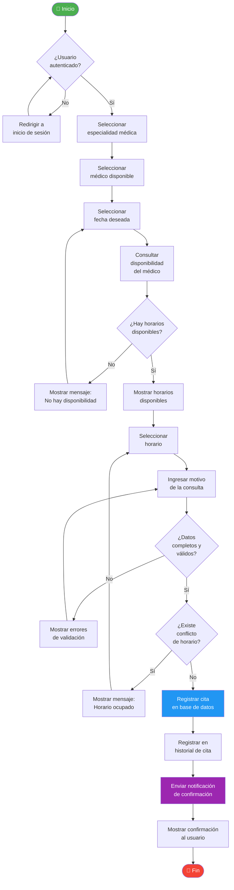
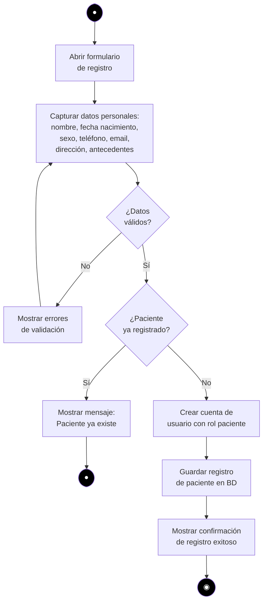
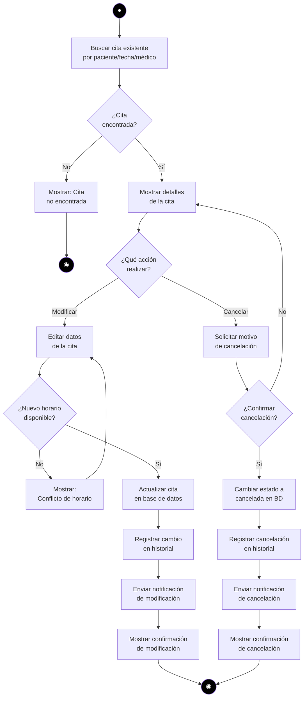
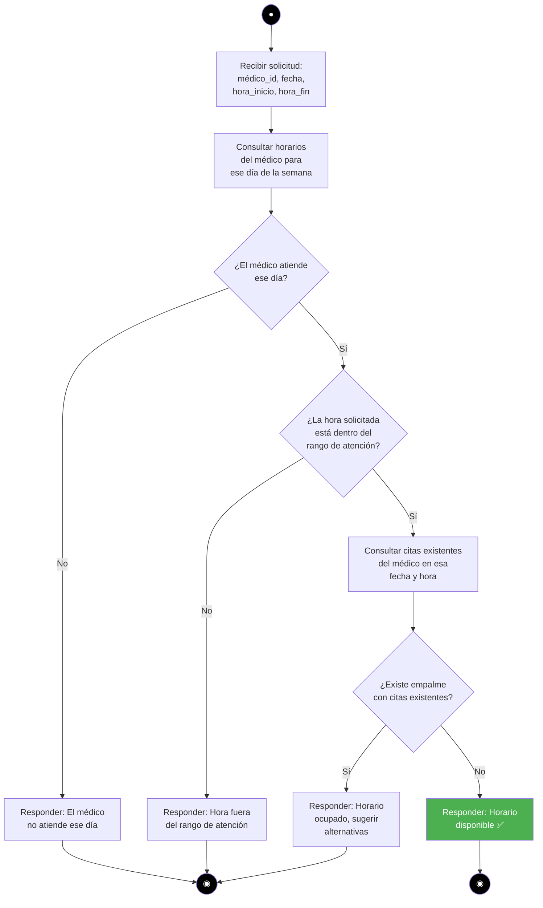
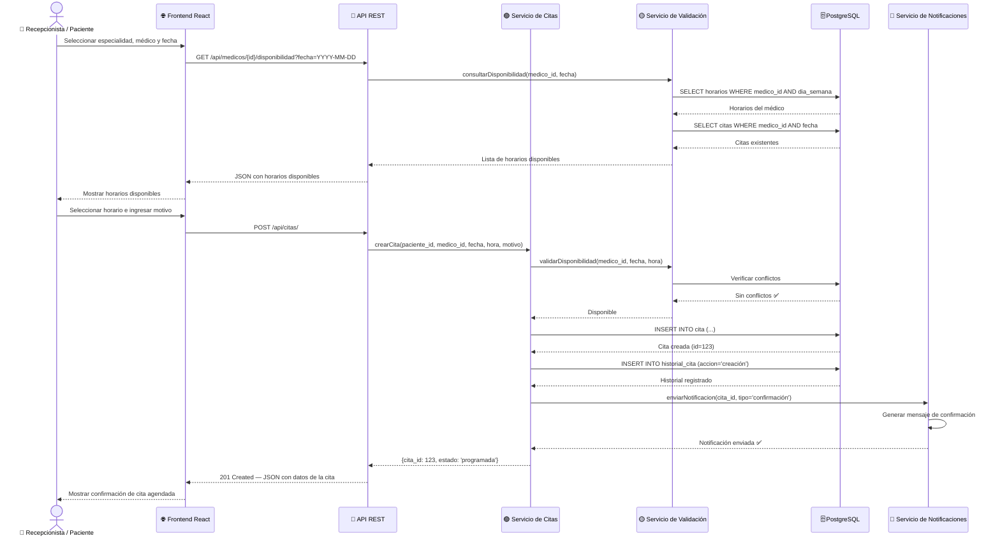
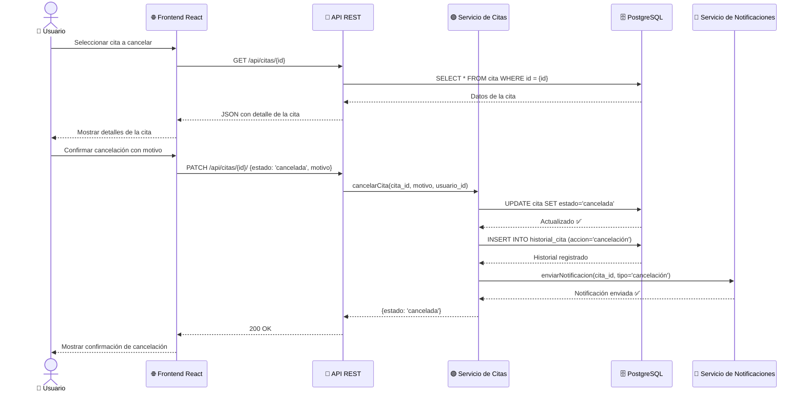
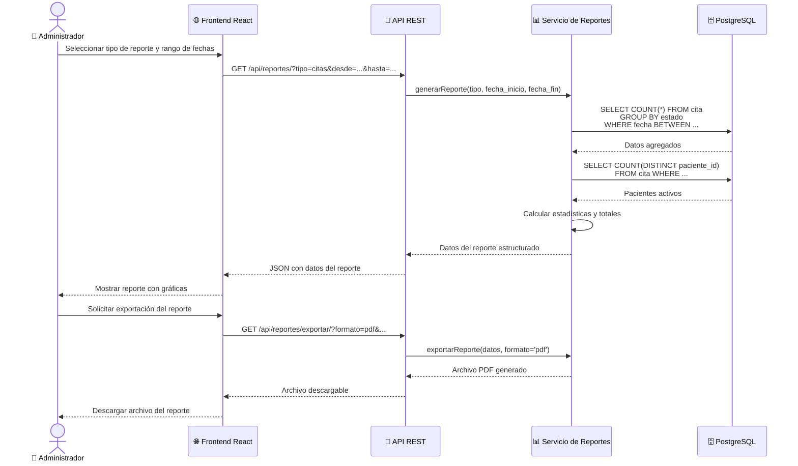
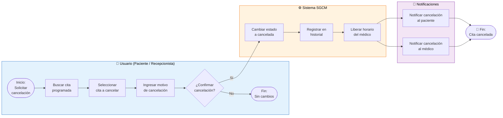

# ⚙️ Diseño de Procesos — SGCM

**Proyecto:** Sistema de Gestión de Citas Médicas  
**Versión:** 1.0 | **Fecha:** 2026

---

## 1. Diagrama de Flujo — Proceso Principal: Agendar Cita

Este diagrama describe la secuencia lógica completa del proceso de agendar una cita médica.

---

## 2. Diagramas de Actividades (UML)

### 2.1 Actividad: Registrar Paciente (RF-01)

### 2.2 Actividad: Gestionar Citas — Modificar y Cancelar (RF-02)

### 2.3 Actividad: Validar Disponibilidad de Horarios (RF-03)

---

## 3. Diagramas de Secuencia (UML)

### 3.1 Secuencia: Agendar Cita Médica

### 3.2 Secuencia: Cancelar Cita Médica

### 3.3 Secuencia: Generar Reporte Administrativo

---

## 4. Diagrama BPMN — Proceso Completo de Gestión de Cita Médica

Este diagrama modela el proceso de negocio completo de una cita médica, desde la solicitud hasta la atención o cancelación.

```mermaid
flowchart LR
    subgraph PACIENTE["🧑 Paciente"]
        P1([Inicio:<br/>Necesita cita]) --> P2[Ingresar<br/>al sistema]
        P2 --> P3[Seleccionar<br/>especialidad<br/>y médico]
        P3 --> P4[Elegir fecha<br/>y horario]
    end

    subgraph SISTEMA["⚙️ Sistema SGCM"]
        S1{¿Horario<br/>disponible?}
        S2[Registrar cita<br/>en BD]
        S3[Generar registro<br/>en historial]
        S4[Preparar<br/>notificación]
    end

    subgraph NOTIFICACIONES["📧 Servicio de Notificaciones"]
        N1[Enviar confirmación<br/>al paciente]
        N2[Enviar aviso<br/>al médico]
    end

    subgraph MEDICO["👨‍⚕️ Médico"]
        M1[Recibir<br/>notificación]
        M2[Consultar<br/>agenda del día]
        M3[Atender<br/>al paciente]
        M4[Marcar cita<br/>como atendida]
    end

    subgraph RECEPCION["👩‍💼 Recepción"]
        R1[Confirmar<br/>asistencia<br/>del paciente]
    end

    P4 --> S1
    S1 -->|No| P4
    S1 -->|Sí| S2
    S2 --> S3
    S3 --> S4
    S4 --> N1
    S4 --> N2
    N2 --> M1
    N1 --> ESPERA([⏰ Esperar<br/>día de cita])
    ESPERA --> R1
    M1 --> M2
    R1 --> M3
    M2 --> M3
    M3 --> M4
    M4 --> FIN([🔴 Fin:<br/>Cita atendida])

    style PACIENTE fill:#E3F2FD,stroke:#1565C0,color:#000
    style SISTEMA fill:#FFF3E0,stroke:#EF6C00,color:#000
    style NOTIFICACIONES fill:#F3E5F5,stroke:#7B1FA2,color:#000
    style MEDICO fill:#E8F5E9,stroke:#2E7D32,color:#000
    style RECEPCION fill:#FFF8E1,stroke:#F9A825,color:#000
```

---

## 5. Diagrama BPMN — Subproceso: Cancelación de Cita

---

## 6. Resumen de Trazabilidad: Procesos → Requisitos

| Diagrama | Requisito(s) | Proceso Modelado |
|----------|-------------|------------------|
| Diagrama de Flujo — Agendar Cita | RF-02, RF-03 | Flujo completo de agendamiento |
| Actividad: Registrar Paciente | RF-01 | Alta de nuevo paciente |
| Actividad: Gestionar Citas | RF-02 | Modificación y cancelación |
| Actividad: Validar Disponibilidad | RF-03 | Lógica de validación de empalmes |
| Secuencia: Agendar Cita | RF-02, RF-03, RF-04 | Interacciones entre componentes |
| Secuencia: Cancelar Cita | RF-02, RF-04 | Flujo de cancelación |
| Secuencia: Generar Reporte | RF-05 | Proceso de reportes |
| BPMN: Gestión de Cita | RF-01 a RF-05 | Proceso de negocio completo |
| BPMN: Cancelación | RF-02, RF-04 | Subproceso de cancelación |
