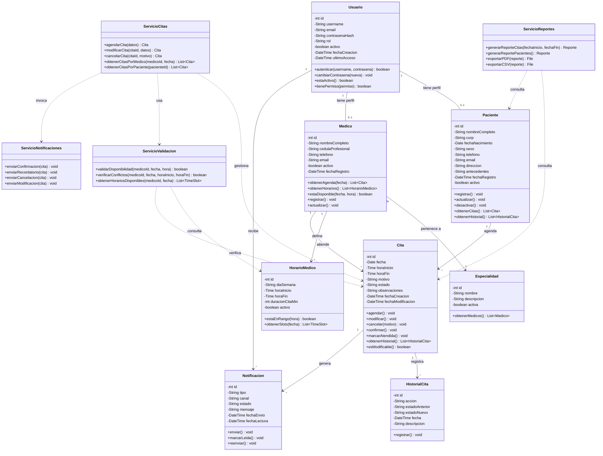
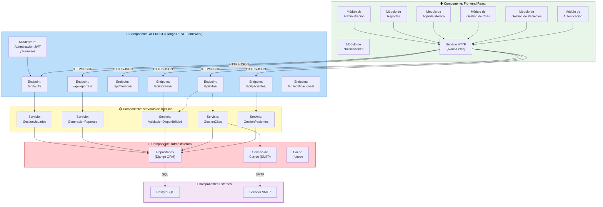

# 🧱 Diseño Estructural — SGCM

**Proyecto:** Sistema de Gestión de Citas Médicas  
**Versión:** 1.0 | **Fecha:** 2026

---

## 1. Diagrama de Clases UML

Define las clases del dominio, sus atributos, métodos y relaciones (herencia, asociación, composición).

---

## 2. Diagrama de Componentes UML

Identifica los módulos principales del software y sus dependencias técnicas.

---

## 3. Dependencias entre Componentes

| Componente Origen | Componente Destino | Tipo de Dependencia | Protocolo |
|-------------------|--------------------|---------------------|-----------|
| Frontend React | API REST Django | Consumo de servicios | HTTPS / JSON |
| API REST | Servicios de Dominio | Invocación directa | Python |
| Servicios de Dominio | Repositorios (ORM) | Acceso a datos | Django ORM |
| Servicios de Dominio | Servicio de Correo | Envío de notificaciones | SMTP / API |
| Repositorios | PostgreSQL | Persistencia | SQL / TCP |
| Servicio de Correo | Servidor SMTP | Envío de emails | SMTP |
| Middleware JWT | Todos los endpoints | Interceptor de seguridad | Python |

---

## 4. Principios de Diseño Aplicados

| Principio | Aplicación en el SGCM |
|-----------|----------------------|
| **Responsabilidad Única (SRP)** | Cada servicio de dominio gestiona una sola entidad o proceso |
| **Abierto/Cerrado (OCP)** | Nuevos módulos (ej. pagos) se agregan sin modificar los existentes |
| **Inversión de Dependencias (DIP)** | Los servicios dependen de abstracciones (repositorios), no del ORM directamente |
| **Separación de Preocupaciones** | Frontend, API, dominio e infraestructura en capas independientes |
| **Bajo Acoplamiento** | Comunicación entre frontend y backend solo vía API REST |
| **Alta Cohesión** | Cada módulo agrupa funcionalidades relacionadas |
