# 🎨 Diseño de Interfaces (UI/UX) — SGCM

**Proyecto:** Sistema de Gestión de Citas Médicas  
**Versión:** 1.0 | **Fecha:** 2026

---

## 1. Paleta de Colores Oficial

La identidad visual del SGCM se basa en una paleta que combina **azules profundos** con **neutros cálidos**, transmitiendo profesionalismo médico con calidez humana.

### 1.1 Colores de la Paleta

| Color | Nombre | HEX | RGB | Uso principal |
|:-----:|--------|:---:|:---:|---------------|
| 🟦 | **Sapphire** | `#3C5070` | 49, 80, 112 | Textos principales, encabezados, íconos activos |
| 🟫 | **Royal Blue** | `#112250` | 17, 34, 80 | Barra lateral, header superior ⚠️ *Usar con moderación* |
| 🟨 | **Quicksand** | `#E0C58F` | 224, 181, 143 | Acentos, badges, botones secundarios, separadores |
| ⬜ | **Swan Wing** | `#F5F0E9` | 245, 240, 233 | Fondo general de la aplicación |
| 🟫 | **Shellstone** | `#D9C8C2` | 217, 200, 194 | Bordes suaves, fondos de tarjetas alternos, hover |

### 1.2 Filosofía del Color

| Principio | Aplicación |
|-----------|------------|
| **Azules = Seguridad y profesionalismo** | Sidebar y header en Royal Blue (#112250); textos y títulos en Sapphire (#3C5070) |
| **Neutros claros = Higiene y orden** | Fondo Swan Wing (#F5F0E9) transmite limpieza clínica sin ser frío |
| **Beige dorado = Calidez humana** | Quicksand (#E0C58F) suaviza la frialdad del azul en acentos y badges |
| **Contraste = Humanización** | La combinación azul + dorado crea un equilibrio entre lo institucional y lo acogedor |

> ⚠️ **Regla importante:** No abusar de `#112250` (Royal Blue). Reservarlo exclusivamente para sidebar y header. El color dominante en la interfaz debe ser el fondo claro Swan Wing.

### 1.3 Asignación de Colores por Elemento UI

| Elemento | Color | HEX | Notas |
|----------|-------|:---:|-------|
| **Fondo general** | Swan Wing | `#F5F0E9` | Fondo de toda la aplicación |
| **Barra lateral (sidebar)** | Royal Blue | `#112250` | Texto e íconos del menú en blanco (#FFFFFF) |
| **Header / barra superior** | Royal Blue | `#112250` | Con el logo y nombre del usuario |
| **Tarjetas / cards** | Blanco | `#FFFFFF` | Con bordes sutiles en Shellstone |
| **Bordes de tarjetas** | Shellstone | `#D9C8C2` | Bordes de 1px, border-radius: 12px |
| **Títulos y encabezados** | Sapphire | `#3C5070` | Títulos de secciones y pantallas |
| **Texto del cuerpo** | Sapphire oscuro | `#3C5070` | Textos generales y etiquetas |
| **Texto secundario** | Sapphire claro | `#3C5070` al 60% | Subtítulos, texto de ayuda |
| **Botones primarios** | Sapphire | `#3C5070` | Texto blanco, border-radius: 8px |
| **Botones secundarios** | Quicksand | `#E0C58F` | Texto Sapphire, borde dorado |
| **Badges / etiquetas** | Quicksand | `#E0C58F` | Fondo dorado suave, texto Sapphire |
| **Íconos del sidebar activo** | Quicksand | `#E0C58F` | Resaltar la sección actual con dorado |
| **Íconos del sidebar inactivo** | Blanco | `#FFFFFF` al 70% | Menor opacidad para diferencia |
| **Campos de formulario** | Blanco | `#FFFFFF` | Borde Shellstone, fondo blanco |
| **Estados — Confirmada** | Verde suave | `#4CAF50` | Badge con fondo verde claro |
| **Estados — Cancelada** | Rojo suave | `#E57373` | Badge con fondo rojo claro |
| **Estados — Pendiente / Llegó** | Quicksand | `#E0C58F` | Badge dorado |
| **Estados — Disponible** | Shellstone | `#D9C8C2` | Texto gris suave |
| **Hover sobre filas** | Swan Wing | `#F5F0E9` | Efecto sutil al pasar el cursor |
| **Botón de cancelar / peligro** | Rojo suave | `#E57373` | Para acciones destructivas |

---

## 2. Wireframes — Pantallas Principales

Los wireframes reflejan el diseño real de la interfaz con la identidad visual de Clínica Patito.

### 2.1 Pantalla: Inicio de Sesión

```
┌──────────────────────────────────────────────────────────┐
│                  FONDO: #112250 (Royal Blue)              │
│                  con degradado sutil                      │
│                                                          │
│              ┌────────────────────────────┐               │
│              │  TARJETA: #FFFFFF          │               │
│              │  border-radius: 16px       │               │
│              │  sombra suave              │               │
│              │                            │               │
│              │   ⛨ Clínica Patito         │               │
│              │   Logo + nombre (#3C5070)  │               │
│              │                            │               │
│              │  ┌──────────────────────┐  │               │
│              │  │ Usuario          👤  │  │               │
│              │  │ borde: #D9C8C2       │  │               │
│              │  └──────────────────────┘  │               │
│              │  ┌──────────────────────┐  │               │
│              │  │ Contraseña       🔒  │  │               │
│              │  │ borde: #D9C8C2       │  │               │
│              │  └──────────────────────┘  │               │
│              │                            │               │
│              │  ☐ Recordar sesión         │               │
│              │     texto: #3C5070         │               │
│              │                            │               │
│              │  ┌──────────────────────┐  │               │
│              │  │  INICIAR SESIÓN      │  │               │
│              │  │  bg: #3C5070         │  │               │
│              │  │  text: #FFFFFF       │  │               │
│              │  └──────────────────────┘  │               │
│              │                            │               │
│              │  ¿Olvidaste tu contraseña? │               │
│              │  link: #E0C58F             │               │
│              └────────────────────────────┘               │
│                                                          │
└──────────────────────────────────────────────────────────┘
```

### 2.2 Pantalla: Dashboard Principal (Recepcionista)

```
┌──────────────────────────────────────────────────────────────────┐
│ bg: #112250   ⛨ Clínica Patito                🔔  👤 Ana R. ▾ │
├────────────┬─────────────────────────────────────────────────────┤
│ SIDEBAR    │  FONDO: #F5F0E9 (Swan Wing)                        │
│ bg:#112250 │                                                     │
│ text:#FFF  │  ┌─ TARJETA bg:#FFFFFF bd:#D9C8C2 ─────────────┐  │
│            │  │ 📅 Citas Hoy  👥+Pac. nuevos  ⚠ Pendientes │  │
│ 🏠 Inicio  │  │     12              3              2         │  │
│   (#E0C58F)│  │ text: #3C5070    badges: #E0C58F             │  │
│ 👥 Pacient.│  └──────────────────────────────────────────────┘  │
│ 📅 Citas   │                                                     │
│ 📊 Reportes│  ┌─ Próximas citas (hoy) ──┐  ┌─ Acciones ──────┐ │
│ ⚙ Config.  │  │                          │  │                  │ │
│            │  │ 09:00 Juan Pérez         │  │ 👥+ Registrar    │ │
│            │  │       Dr. García         │  │   nuevo paciente │ │
│            │  │ 10:00 María López        │  │                  │ │
│            │  │       Dr. García         │  │ 📅 Agendar cita  │ │
│            │  │ 11:30 Carlos Ruiz        │  │                  │ │
│            │  │       Dra. Medina        │  │ 🔍 Buscar        │ │
│            │  │                          │  │   paciente       │ │
│            │  │  → Ver todas (#E0C58F)   │  │                  │ │
│            │  └──────────────────────────┘  └──────────────────┘ │
│            │                                                     │
│            │  ┌─ Actividad reciente ─────────────────────────┐  │
│            │  │ 08:45  Cita confirmada: Pedro Sánchez        │  │
│            │  │ 08:30  Nuevo paciente: Lucía Fernández       │  │
│            │  │ 07:55  Cita cancelada: Laura Méndez          │  │
│            │  └──────────────────────────────────────────────┘  │
└────────────┴─────────────────────────────────────────────────────┘

Leyenda de colores:
• Sidebar activo: ícono y texto en #E0C58F (Quicksand)
• Sidebar inactivo: ícono y texto en #FFFFFF al 70%
• Tarjetas: bg #FFFFFF, borde #D9C8C2, border-radius 12px
• Badges numéricos: bg #E0C58F, text #3C5070
• Texto principal: #3C5070 (Sapphire)
```

### 2.3 Pantalla: Gestión de Pacientes

```
┌──────────────────────────────────────────────────────────────────┐
│ bg: #112250   ⛨ Clínica Patito                🔔  👤 Ana R. ▾ │
├────────────┬─────────────────────────────────────────────────────┤
│ SIDEBAR    │  FONDO: #F5F0E9                                     │
│ bg:#112250 │                                                     │
│            │  👥 Gestión de Pacientes                            │
│ 🏠 Inicio  │  text: #3C5070           [🟦 Nuevo paciente]       │
│ 👥 Pacient.│                           btn bg:#3C5070 text:#FFF  │
│   (#E0C58F)│                      [📤 Exportar] [🔧 Filtros]    │
│ 📅 Citas   │                       btn bg:#E0C58F text:#3C5070   │
│ 📊 Reportes│                                                     │
│ ⚙ Config.  │  ┌──── Estadísticas ────────────────────────────┐  │
│            │  │ Total pac.│ Nuevos(mes)│ Con cita │ Sin email │  │
│            │  │   1,284   │    47      │   12     │    23     │  │
│            │  │  badges con borde #D9C8C2, text #3C5070      │  │
│            │  └──────────────────────────────────────────────┘  │
│            │                                                     │
│            │  ┌─ 🔍 Buscador ────────────────────────────────┐  │
│            │  │ [Buscar nombre, teléfono, email...]          │  │
│            │  │  input bg:#FFF borde:#D9C8C2                 │  │
│            │  │  [Todos][Activos][Inactivos][Cita hoy]       │  │
│            │  │   filtros: activo=#3C5070, inactivo=#D9C8C2  │  │
│            │  └──────────────────────────────────────────────┘  │
│            │                                                     │
│            │  ┌─ Tabla bg:#FFFFFF borde:#D9C8C2 ─────────────┐  │
│            │  │ Avatar│Paciente │Contacto│F.Nac│Últ.cita│Est.│  │
│            │  │ ──────│─────────│────────│─────│────────│────│  │
│            │  │  JP   │J.Pérez  │55-1234 │15/03│10/04   │🟢 │  │
│            │  │  ML   │M.López  │55-9876 │22/07│15/04   │🟢 │  │
│            │  │  CR   │C.Ruiz   │55-4455 │03/11│12/04   │🟢 │  │
│            │  │                                              │  │
│            │  │  Avatares: círculos bg:#3C5070 text:#FFF     │  │
│            │  │  Estado activo: badge bg:#E0C58F             │  │
│            │  │  Hover fila: bg:#F5F0E9                      │  │
│            │  │                                              │  │
│            │  │  ◀ 1  2  3  4 ... 12 ▶                      │  │
│            │  │  página activa: bg:#3C5070 text:#FFF         │  │
│            │  └──────────────────────────────────────────────┘  │
│            │                                                     │
│            │  [📋 Recordar pac. inactivos]  [📥 Importar lista] │
│            │   botones: bg:#3C5070 text:#FFF                     │
└────────────┴─────────────────────────────────────────────────────┘
```

### 2.4 Pantalla: Registro de Paciente

```
┌──────────────────────────────────────────────────────────────────┐
│ bg: #112250   ⛨ Clínica Patito                🔔  👤 Ana R. ▾ │
├────────────┬─────────────────────────────────────────────────────┤
│ SIDEBAR    │  FONDO: #F5F0E9                                     │
│ bg:#112250 │                                                     │
│            │  👥 Registrar nuevo paciente                        │
│ 🏠 Inicio  │  título: #3C5070                                    │
│ 👥 Pacient.│                                                     │
│   (#E0C58F)│  ┌─ TARJETA bg:#FFFFFF bd:#D9C8C2 ─────────────┐  │
│ 📅 Citas   │  │                                              │  │
│ 📊 Reportes│  │  Nombre completo *     Fecha de nacimiento * │  │
│ ⚙ Config.  │  │  [________________]   [__/__/____]           │  │
│            │  │  input bg:#FFF bd:#D9C8C2                    │  │
│            │  │  label: #3C5070                               │  │
│            │  │                                              │  │
│            │  │  Teléfono *             Correo electrónico   │  │
│            │  │  [________________]   [________________]     │  │
│            │  │                                              │  │
│            │  │  Calle                  Número               │  │
│            │  │  [________________]   [________________]     │  │
│            │  │                                              │  │
│            │  │  Ciudad                 C.P.                 │  │
│            │  │  [________________]   [________________]     │  │
│            │  │                                              │  │
│            │  └──────────────────────────────────────────────┘  │
│            │                                                     │
│            │  ┌──────────────────┐  ┌──────────────────────┐    │
│            │  │ 💾 Guardar pac.  │  │ ✕ Cancelar           │    │
│            │  │ bg:#3C5070       │  │ bg:#E57373           │    │
│            │  │ text:#FFF        │  │ text:#FFF            │    │
│            │  └──────────────────┘  └──────────────────────┘    │
└────────────┴─────────────────────────────────────────────────────┘

Notas de color:
• Labels de campos: #3C5070 (Sapphire)
• Inputs: fondo #FFFFFF, borde #D9C8C2 (Shellstone)
• Input enfocado: borde #3C5070
• Botón guardar: bg #3C5070, text #FFFFFF
• Botón cancelar: bg #E57373, text #FFFFFF
• Asterisco obligatorio: #E57373
```

### 2.5 Pantalla: Gestión de Citas

```
┌──────────────────────────────────────────────────────────────────┐
│ bg: #112250   ⛨ Clínica Patito                🔔  👤 Ana R. ▾ │
├────────────┬─────────────────────────────────────────────────────┤
│ SIDEBAR    │  FONDO: #F5F0E9                                     │
│ bg:#112250 │                                                     │
│            │  📅 Gestión de Citas                                │
│ 🏠 Inicio  │  títulos: #3C5070                                   │
│ 👥 Pacient.│         [🟦 Nueva cita] [Vista semana] [🔧Filtros] │
│ 📅 Citas   │                                                     │
│   (#E0C58F)│  [📊 Línea de tiempo] [📅 Calendario] [≡ Lista]    │
│ 📊 Reportes│   tabs activa: bd-bottom #E0C58F                    │
│ ⚙ Config.  │                   📅 15 abril 2026  ◀  ▶          │
│            │                                                     │
│            │  ┌─ Calendario ────┐  ┌─ Agenda médica ──────────┐ │
│            │  │ Abril 2026      │  │ [Todos][Dr.García][Dra.M] │ │
│            │  │ L M M J V S D   │  │  filtros: #E0C58F activo  │ │
│            │  │     1 2 3 4 5 6 │  │                           │ │
│            │  │ 7 8 9 ...       │  │ 09:00 ┌──────────────┐   │ │
│            │  │ 14[15]16 17 ... │  │       │ Juan Pérez   │   │ │
│            │  │ 21 22 23 ...    │  │       │ Dr. García   │   │ │
│            │  │ 28 29 30        │  │       │ 🟢Confirmada │   │ │
│            │  │                 │  │       └──────────────┘   │ │
│            │  │ hoy: bg:#3C5070 │  │ 10:00 ┌──────┐┌──────┐  │ │
│            │  │ text:#FFF       │  │       │M.López││P.Snch│  │ │
│            │  │ 🟦 12 citas hoy│  │       │🟡Llegó││🟢Conf│  │ │
│            │  │ 🔵 3 médicos   │  │       └──────┘└──────┘  │ │
│            │  │                 │  │ 11:00 ┌──────────────┐   │ │
│            │  └─────────────────┘  │       │ Carlos Ruiz  │   │ │
│            │                       │       │ 🔴Cancelada  │   │ │
│            │                       │       └──────────────┘   │ │
│            │                       │ 12:00  ⊕ Horario disp.  │ │
│            │                       │  (#D9C8C2 text)          │ │
│            │                       └──────────────────────────┘ │
│            │                                                     │
│            │  ┌─ Citas programadas para hoy ─────────────────┐  │
│            │  │ Hora │Av│Paciente  │Médico    │Motivo │Estado │  │
│            │  │ 09:00│JP│J.Pérez   │Dr.García │Control│🟢Conf│  │
│            │  │ 10:00│ML│M.López   │Dr.García │Dolor  │🟡Llegó│  │
│            │  │ 10:00│PS│P.Sánchez │Dra.Medina│Revis. │🟢Conf│  │
│            │  │ 11:00│CR│C.Ruiz    │Dr.García │Rev. rx│🔴Canc│  │
│            │  │                                              │  │
│            │  │ Avatares: bg:#3C5070 text:#FFF               │  │
│            │  │ Confirmada: badge bg:#4CAF50 text:#FFF       │  │
│            │  │ Llegó: badge bg:#E0C58F text:#3C5070         │  │
│            │  │ Cancelada: badge bg:#E57373 text:#FFF        │  │
│            │  └──────────────────────────────────────────────┘  │
│            │                                                     │
│            │  [📧 Enviar recordatorios]   [📅 Agendar rápida]   │
│            │   bg:#D9C8C2 text:#3C5070    bg:#3C5070 text:#FFF   │
└────────────┴─────────────────────────────────────────────────────┘
```

### 2.6 Pantalla: Agenda del Médico

```
┌──────────────────────────────────────────────────────────────────┐
│ bg: #112250   ⛨ Clínica Patito                🔔  👤 Ana R. ▾ │
├────────────┬─────────────────────────────────────────────────────┤
│ SIDEBAR    │  FONDO: #F5F0E9                                     │
│ bg:#112250 │                                                     │
│            │  🗓 Agenda del Dr. García · 15 Abril 2026           │
│ 🏠 Inicio  │  título: #3C5070                  ◀ [Hoy] ▶       │
│ 👥 Pacient.│                                                     │
│ 📅 Citas   │  ┌─ TARJETA bg:#FFFFFF bd:#D9C8C2 ─────────────┐  │
│   (#E0C58F)│  │ Hora │ Paciente     │ Motivo      │ Estado   │  │
│ 📊 Reportes│  │──────│──────────────│─────────────│──────────│  │
│ ⚙ Config.  │  │09:00 │ Juan Pérez   │ Control anual│🟢 Conf. │  │
│            │  │10:00 │ María López  │ Dolor cabeza│🟡 Llegó  │  │
│            │  │11:00 │ Carlos Ruiz  │ Revisión rx │🔴 Canc.  │  │
│            │  │12:00 │ — Libre —    │             │ Disponible│  │
│            │  │       text: #D9C8C2                           │  │
│            │  │ separadores de fila: 1px #F5F0E9              │  │
│            │  └──────────────────────────────────────────────┘  │
│            │                                                     │
│            │  ┌─Paciente seleccionado─┐  ┌─Notas de consulta─┐  │
│            │  │ 👤 Juan Pérez         │  │ ✏ Notas de        │  │
│            │  │ Seleccione una cita   │  │   consulta         │  │
│            │  │ para más detalles     │  │                    │  │
│            │  │ 📞 55-1234-5678      │  │ [área de texto]    │  │
│            │  │ text: #3C5070         │  │ bg:#FFF bd:#D9C8C2 │  │
│            │  └───────────────────────┘  └────────────────────┘  │
└────────────┴─────────────────────────────────────────────────────┘

Colores de estado en la agenda:
• 🟢 Confirmada: bg #4CAF50 15%, text #2E7D32, badge redondeado
• 🟡 Llegó:      bg #E0C58F 30%, text #3C5070, badge redondeado
• 🔴 Cancelada:  bg #E57373 15%, text #C62828, badge redondeado
• Disponible:    text #D9C8C2 (Shellstone), sin badge
```

### 2.7 Pantalla: Reportes Administrativos

```
┌──────────────────────────────────────────────────────────────────┐
│ bg: #112250   ⛨ Clínica Patito                🔔  👤 Admin ▾  │
├────────────┬─────────────────────────────────────────────────────┤
│ SIDEBAR    │  FONDO: #F5F0E9                                     │
│ bg:#112250 │                                                     │
│            │  📊 Reportes Administrativos                        │
│ 🏠 Inicio  │  título: #3C5070                                    │
│ 👥 Usuarios│                                                     │
│ 📊 Reportes│  ┌─ Filtros bg:#FFFFFF bd:#D9C8C2 ──────────────┐  │
│   (#E0C58F)│  │ Tipo:  [▾ Reporte de Citas       ]          │  │
│ ⚙ Config.  │  │ Desde: [📅 01/01/2026]                      │  │
│            │  │ Hasta: [📅 31/01/2026]                      │  │
│            │  │ inputs bg:#FFF bd:#D9C8C2                    │  │
│            │  │              [🔍 Generar Reporte]            │  │
│            │  │               btn bg:#3C5070 text:#FFF       │  │
│            │  └──────────────────────────────────────────────┘  │
│            │                                                     │
│            │  ┌─ Resumen bg:#FFFFFF bd:#D9C8C2 ──────────────┐  │
│            │  │  Total: 245    │ Atendidas: 198              │  │
│            │  │  Cancel.: 32   │ Pendientes: 15              │  │
│            │  │  números grandes: #3C5070, font-size: 2rem   │  │
│            │  │  labels: #3C5070 al 60%                      │  │
│            │  └──────────────────────────────────────────────┘  │
│            │                                                     │
│            │  ┌─ Gráfica bg:#FFFFFF bd:#D9C8C2 ──────────────┐  │
│            │  │                                              │  │
│            │  │   ████████████████████  198 Atendidas #3C5070│  │
│            │  │   ██████             32 Canceladas #E57373   │  │
│            │  │   ███               15 Pendientes #E0C58F    │  │
│            │  │                                              │  │
│            │  └──────────────────────────────────────────────┘  │
│            │                                                     │
│            │  ┌─ Tabla detalle bg:#FFFFFF bd:#D9C8C2 ────────┐  │
│            │  │ Fecha │ Paciente │ Médico   │ Estado          │  │
│            │  │ 01/01 │ J. Pérez │ Dr.López │ 🟢 Atendida    │  │
│            │  │ 01/01 │ A. García│ Dra.Mtz  │ 🔴 Cancelada   │  │
│            │  │ 02/01 │ L. Rdz.  │ Dr.López │ 🟢 Atendida    │  │
│            │  └──────────────────────────────────────────────┘  │
│            │                                                     │
│            │  ┌──────────────────┐  ┌──────────────────────┐    │
│            │  │ 📄 Exportar PDF  │  │ 📊 Exportar CSV      │    │
│            │  │ bg:#3C5070       │  │ bg:#E0C58F           │    │
│            │  │ text:#FFF        │  │ text:#3C5070         │    │
│            │  └──────────────────┘  └──────────────────────┘    │
└────────────┴─────────────────────────────────────────────────────┘

Colores de las gráficas:
• Barras atendidas:   #3C5070 (Sapphire)
• Barras canceladas:  #E57373 (Rojo suave)
• Barras pendientes:  #E0C58F (Quicksand)
```

---

## 3. Mapa de Navegación por Rol

### 3.1 Mapa General del Sistema

```mermaid
graph TD
    LOGIN["🔐 Inicio de Sesión"]

    LOGIN --> DASH_PAC["📋 Dashboard<br/>Paciente"]
    LOGIN --> DASH_REC["📋 Dashboard<br/>Recepcionista"]
    LOGIN --> DASH_MED["📋 Dashboard<br/>Médico"]
    LOGIN --> DASH_ADM["📋 Dashboard<br/>Administrador"]

    subgraph ROL_PACIENTE["🧑 Vistas del Paciente"]
        DASH_PAC --> MIS_CITAS["📅 Mis Citas"]
        DASH_PAC --> NUEVA_CITA_P["📅 Agendar<br/>Nueva Cita"]
        DASH_PAC --> MI_PERFIL_P["👤 Mi Perfil"]
        DASH_PAC --> MIS_NOTIF_P["🔔 Mis<br/>Notificaciones"]
        MIS_CITAS --> DETALLE_CITA_P["📋 Detalle<br/>de Cita"]
        DETALLE_CITA_P --> CANCELAR_P["❌ Cancelar<br/>Cita"]
    end

    subgraph ROL_RECEPCIONISTA["👩‍💼 Vistas de la Recepcionista"]
        DASH_REC --> PACIENTES["👥 Gestión de<br/>Pacientes"]
        DASH_REC --> CITAS_REC["📅 Gestión<br/>de Citas"]
        DASH_REC --> AGENDA_REC["🗓️ Agenda<br/>General"]
        DASH_REC --> NOTIF_REC["🔔 Notificaciones"]
        PACIENTES --> REG_PAC["➕ Registrar<br/>Paciente"]
        PACIENTES --> EDIT_PAC["✏️ Editar<br/>Paciente"]
        PACIENTES --> VER_PAC["👁️ Ver<br/>Paciente"]
        CITAS_REC --> NUEVA_CITA_R["➕ Agendar<br/>Cita"]
        CITAS_REC --> MODIF_CITA["✏️ Modificar<br/>Cita"]
        CITAS_REC --> CANCEL_CITA["❌ Cancelar<br/>Cita"]
    end

    subgraph ROL_MEDICO["👨‍⚕️ Vistas del Médico"]
        DASH_MED --> MI_AGENDA["🗓️ Mi Agenda"]
        DASH_MED --> MIS_PAC["👥 Mis<br/>Pacientes"]
        DASH_MED --> MI_PERFIL_M["👤 Mi Perfil"]
        MI_AGENDA --> DET_CITA_M["📋 Detalle<br/>de Cita"]
        DET_CITA_M --> MARCAR_AT["✅ Marcar<br/>Atendida"]
    end

    subgraph ROL_ADMIN["🔧 Vistas del Administrador"]
        DASH_ADM --> USUARIOS["👥 Gestión de<br/>Usuarios"]
        DASH_ADM --> REPORTES["📊 Reportes"]
        DASH_ADM --> CONFIG["⚙️ Configuración"]
        DASH_ADM --> ESP_ADM["🏷️ Gestión de<br/>Especialidades"]
        USUARIOS --> CREAR_USR["➕ Crear<br/>Usuario"]
        USUARIOS --> EDIT_USR["✏️ Editar<br/>Usuario"]
        REPORTES --> RPT_CITAS["📊 Reporte<br/>de Citas"]
        REPORTES --> RPT_PAC["📊 Reporte<br/>de Pacientes"]
        REPORTES --> EXPORTAR["📄 Exportar<br/>PDF / CSV"]
    end

    style LOGIN fill:#112250,stroke:#112250,color:#FFF
    style ROL_PACIENTE fill:#F5F0E9,stroke:#3C5070,color:#3C5070
    style ROL_RECEPCIONISTA fill:#F5F0E9,stroke:#3C5070,color:#3C5070
    style ROL_MEDICO fill:#F5F0E9,stroke:#3C5070,color:#3C5070
    style ROL_ADMIN fill:#F5F0E9,stroke:#3C5070,color:#3C5070
```



### 3.2 Matriz de Acceso por Rol

| Vista / Función | Paciente | Recepcionista | Médico | Administrador |
|-----------------|:--------:|:-------------:|:------:|:-------------:|
| Inicio de sesión | ✅ | ✅ | ✅ | ✅ |
| Dashboard | ✅ | ✅ | ✅ | ✅ |
| Ver mis citas | ✅ | — | ✅ | — |
| Agendar cita | ✅ | ✅ | — | — |
| Modificar cita | — | ✅ | — | — |
| Cancelar cita | ✅ | ✅ | — | — |
| Registrar paciente | — | ✅ | — | ✅ |
| Editar paciente | — | ✅ | — | ✅ |
| Ver agenda médica | — | ✅ | ✅ | ✅ |
| Marcar cita atendida | — | — | ✅ | — |
| Gestionar usuarios | — | — | — | ✅ |
| Ver reportes | — | — | — | ✅ |
| Exportar reportes | — | — | — | ✅ |
| Configuración sistema | — | — | — | ✅ |
| Notificaciones | ✅ | ✅ | ✅ | ✅ |
| Mi perfil | ✅ | ✅ | ✅ | ✅ |

---

## 4. Principios de Diseño UI/UX

| Principio | Aplicación en el SGCM |
|-----------|----------------------|
| **Simplicidad** | Formularios limpios con campos bien espaciados; layout de 2 columnas para formularios |
| **Consistencia** | Sidebar fijo (#112250) + header superior + fondo Swan Wing en todas las vistas |
| **Retroalimentación** | Badges de color codificados por estado (verde/dorado/rojo); mensajes de confirmación |
| **Accesibilidad** | Alto contraste: texto Sapphire sobre fondo claro; inputs con bordes visibles Shellstone |
| **Responsividad** | Sidebar colapsable en móvil; tarjetas que se apilan verticalmente en pantallas pequeñas |
| **Prevención de errores** | Validación en tiempo real; campos obligatorios marcados con *; confirmación antes de cancelar |
| **Identidad visual** | Paleta consistente de 5 colores; azul + dorado transmite confianza con calidez humana |

---

## 5. Especificaciones de Tipografía

| Elemento | Familia tipográfica | Peso | Tamaño | Color |
|----------|-------------------|------|--------|-------|
| Títulos de página | Inter / Roboto | Bold (700) | 24px | #3C5070 |
| Subtítulos de sección | Inter / Roboto | SemiBold (600) | 18px | #3C5070 |
| Texto del cuerpo | Inter / Roboto | Regular (400) | 14px | #3C5070 |
| Labels de formulario | Inter / Roboto | Medium (500) | 13px | #3C5070 |
| Texto del sidebar | Inter / Roboto | Medium (500) | 14px | #FFFFFF |
| Badges / etiquetas | Inter / Roboto | SemiBold (600) | 12px | Según estado |
| Números grandes (stats) | Inter / Roboto | Bold (700) | 32px | #3C5070 |

---

## 6. Especificaciones de Componentes

| Componente | Border-radius | Sombra | Padding | Notas |
|------------|:------------:|--------|---------|-------|
| Tarjetas | 12px | `0 2px 8px rgba(0,0,0,0.06)` | 24px | Fondo #FFFFFF, borde #D9C8C2 |
| Botones primarios | 8px | ninguna | 12px 24px | bg #3C5070, text #FFFFFF |
| Botones secundarios | 8px | ninguna | 12px 24px | bg #E0C58F, text #3C5070 |
| Inputs | 8px | ninguna | 10px 14px | bg #FFFFFF, borde #D9C8C2 |
| Badges de estado | 16px (pill) | ninguna | 4px 12px | Colores según estado |
| Avatares (iniciales) | 50% (círculo) | ninguna | — | bg #3C5070, text #FFFFFF, 36x36px |
| Sidebar | 0px | `4px 0 12px rgba(0,0,0,0.1)` | 16px | bg #112250, ancho 220px |
