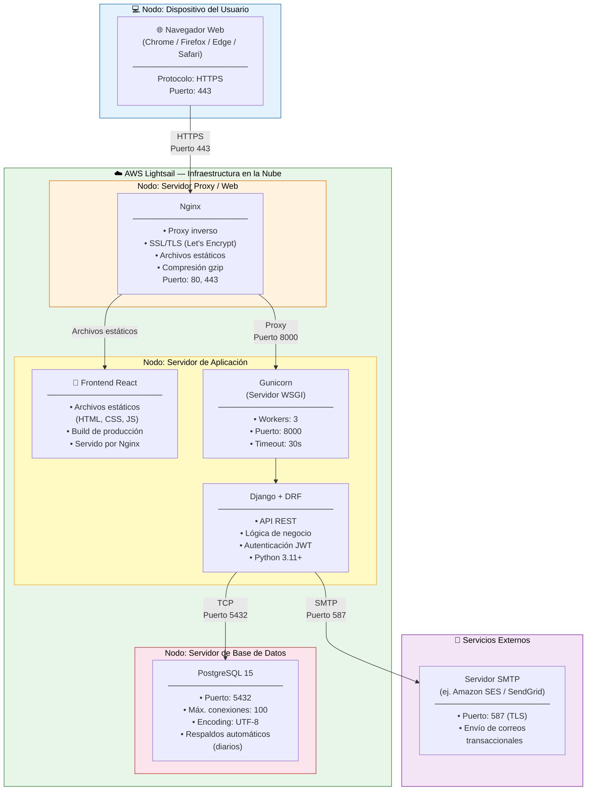
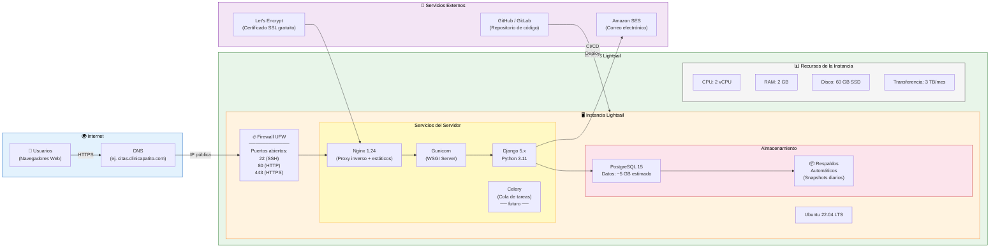

# 🚀 Diseño de Despliegue — SGCM

**Proyecto:** Sistema de Gestión de Citas Médicas  
**Versión:** 1.0 | **Fecha:** 2026

---

## 1. Diagrama de Despliegue UML

Este diagrama detalla los nodos físicos/virtuales donde se alojan los componentes del sistema y las configuraciones del entorno de ejecución.

---

## 2. Diagrama de Infraestructura

Identifica los recursos de hardware/software y servicios de red necesarios para la operación en producción.

---

## 3. Especificación del Entorno de Producción

### 3.1 Servidor de Aplicación

| Recurso | Especificación |
|---------|---------------|
| **Proveedor** | AWS Lightsail |
| **Plan** | 2 vCPU, 2 GB RAM, 60 GB SSD |
| **Sistema operativo** | Ubuntu 22.04 LTS |
| **Servidor web** | Nginx 1.24 (proxy inverso) |
| **Servidor WSGI** | Gunicorn (3 workers) |
| **Runtime** | Python 3.11+ |
| **Framework** | Django 5.x + Django REST Framework |
| **SSL/TLS** | Let's Encrypt (renovación automática) |
| **Costo estimado** | ~$12 USD/mes |

### 3.2 Base de Datos

| Recurso | Especificación |
|---------|---------------|
| **Motor** | PostgreSQL 15 |
| **Ubicación** | Local en la misma instancia (fase inicial) |
| **Almacenamiento estimado** | ~5 GB |
| **Conexiones máximas** | 100 |
| **Encoding** | UTF-8 |
| **Respaldos** | Snapshots automáticos diarios (Lightsail) |
| **Migración futura** | AWS RDS PostgreSQL (cuando escale) |

### 3.3 Servicio de Correo

| Recurso | Especificación |
|---------|---------------|
| **Proveedor** | Amazon SES / SendGrid |
| **Protocolo** | SMTP (puerto 587 con TLS) |
| **Uso estimado** | ~500 correos/día |
| **Tipos de correo** | Confirmación, recordatorio, cancelación, modificación |
| **Costo estimado** | ~$0 - $1 USD/mes (capa gratuita SES) |

---

## 4. Estrategia de Despliegue

```mermaid
flowchart LR
    subgraph DEV["🧑‍💻 Desarrollo"]
        CODE["Escribir código"] --> COMMIT["Git commit + push"]
    end

    subgraph CI["🔄 Integración Continua"]
        COMMIT --> TESTS["Ejecutar tests<br/>automáticos"]
        TESTS --> BUILD["Build del frontend<br/>(npm run build)"]
    end

    subgraph DEPLOY["🚀 Despliegue"]
        BUILD --> PULL["Git pull en<br/>servidor"]
        PULL --> MIGRATE["Ejecutar<br/>migraciones Django"]
        MIGRATE --> COLLECT["Recolectar<br/>archivos estáticos"]
        COLLECT --> RESTART["Reiniciar<br/>Gunicorn"]
        RESTART --> VERIFY["Verificar<br/>estado del sistema"]
    end

    style DEV fill:#E3F2FD,stroke:#1565C0,color:#000
    style CI fill:#FFF3E0,stroke:#EF6C00,color:#000
    style DEPLOY fill:#E8F5E9,stroke:#2E7D32,color:#000
```

### Pasos de despliegue detallados

| Paso | Comando / Acción | Descripción |
|------|------------------|-------------|
| 1 | `git pull origin main` | Obtener última versión del código |
| 2 | `pip install -r requirements.txt` | Instalar dependencias Python |
| 3 | `python manage.py migrate` | Aplicar migraciones de BD |
| 4 | `python manage.py collectstatic` | Recolectar archivos estáticos |
| 5 | `cd frontend && npm run build` | Construir frontend React |
| 6 | `sudo systemctl restart gunicorn` | Reiniciar servidor de aplicación |
| 7 | `sudo systemctl reload nginx` | Recargar configuración Nginx |
| 8 | Verificar estado del sistema | Comprobar logs y funcionamiento |

---

## 5. Seguridad en la Infraestructura

| Medida | Implementación |
|--------|---------------|
| **Firewall** | UFW: solo puertos 22, 80, 443 |
| **SSL/TLS** | Let's Encrypt con renovación automática vía certbot |
| **SSH** | Acceso solo con llave pública, puerto 22 |
| **Base de datos** | Acceso restringido a localhost únicamente |
| **Variables de entorno** | Secretos almacenados en archivo `.env` (no versionado) |
| **Actualizaciones** | Parches de seguridad automáticos del SO |
| **Respaldos** | Snapshots diarios + pg_dump semanal |
| **Monitoreo** | Logs de Nginx + Django, alertas por correo |

---

## 6. Plan de Escalabilidad Futura

| Fase | Acción | Justificación |
|------|--------|---------------|
| **Fase 1** (Actual) | Instancia única con PostgreSQL local | Suficiente para la clínica inicial |
| **Fase 2** | Migrar PostgreSQL a AWS RDS | Mayor disponibilidad y respaldos administrados |
| **Fase 3** | Agregar Celery + Redis para tareas asíncronas | Notificaciones programadas y reportes pesados |
| **Fase 4** | Load balancer + múltiples instancias | Alta disponibilidad si crece la demanda |
| **Fase 5** | CDN (CloudFront) para archivos estáticos | Mayor velocidad de carga global |
